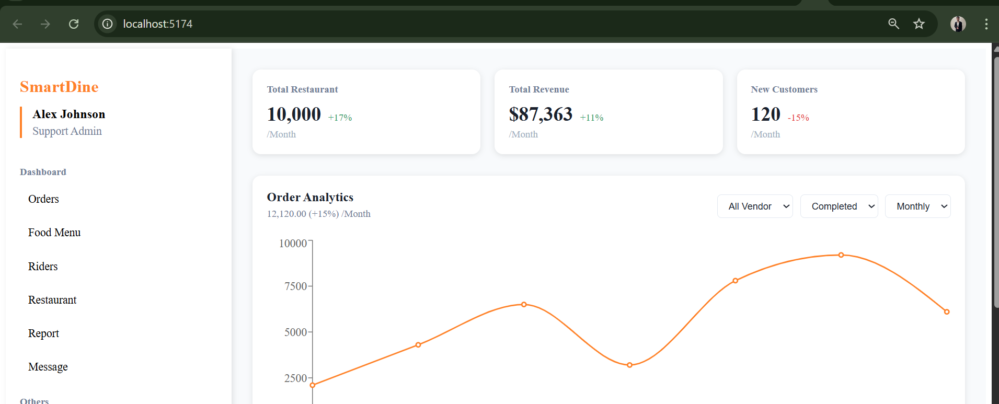

  

<!-- project overview -->

> SmartDine is a next-generation restaurant management system combining real-time operations with AI-powered insights.
>
> From digital menus to automated inventory, our platform streamlines every aspect of restaurant operations.

  

<!-- System Design -->

### System Architecture

- **Frontend**: React.js (Admin) + Flutter (Mobile)
- **Backend**: Laravel API + Node.js for real-time
- **Database**: MySQL with Redis caching
- **Infrastructure**: Docker containers on AWS EC2

  

<!-- Project Highlights -->

### Key Features

- Real-time order tracking dashboard
- AI-powered menu recommendations
- Inventory management with auto-alerts
- Staff performance analytics
- Customer loyalty insights

  

<!-- Demo -->

### User Screens (Mobile)

| Login Screen                          | Menu Screen                         | Order Screen                       |
| ------------------------------------- | ----------------------------------- | ---------------------------------- |
|      |      |   |

### Admin Screens (Web)

| Dashboard                             | Restaurant Management              | Order Analytics                   |
| ------------------------------------- | ---------------------------------- | --------------------------------- |
| |  |  |

| Menu Editor                           | Customer Insights                  |
| ------------------------------------- | ---------------------------------- |
|       |  |

  

<!-- Development & Testing -->

### Development Process

| Services Architecture                | API Validation                     | Test Coverage                     |
| ------------------------------------ | ---------------------------------- | --------------------------------- |
|    |  |  |

  

<!-- Deployment -->

### Deployment Pipeline

- CI/CD via GitHub Actions
- Docker containers on AWS
- Automated backups
- Zero-downtime deployments

| Auth API                             | Menu API                          | Orders API                        |
| ------------------------------------ | --------------------------------- | --------------------------------- |
|        |     |  |

  
