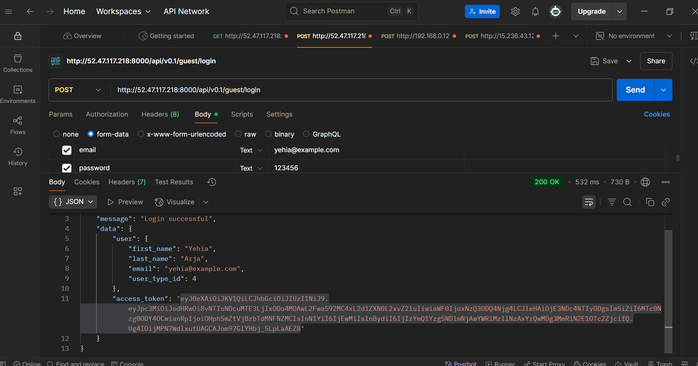
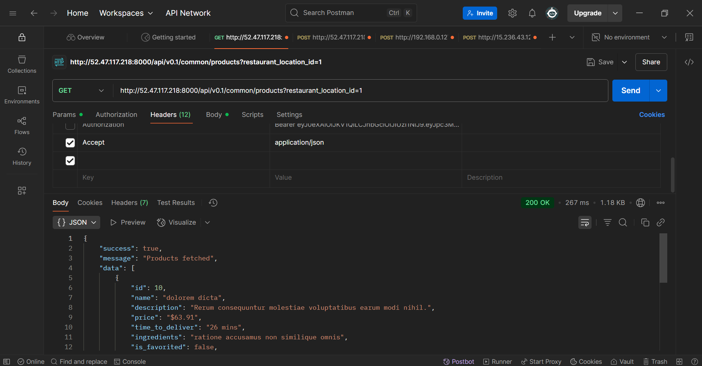

  

<!-- project overview -->

> **SmartDine** is a cloud-powered restaurant system built for speed, scalability, and real-time operations.  
> From AR menus and AI combos to live seat tracking and AI assistant — everything works instantly and in sync.  
> Clean Flutter UI. Secure Laravel backend. Real-time updates via WebSockets.  
> Built to scale. Easy to use. Feels like magic, runs like engineering ⚙️

  

<!-- System Design -->

### Architecture Overview

✅ **Client App**: Flutter mobile app  
✅ **API Layer**: Laravel backend for business logic  
✅ **Real-Time**: Node.js + Socket.IO for WebSocket updates  
✅ **Infrastructure**: Docker + GitHub Actions → AWS EC2  
✅ **Performance**: Redis for caching and queues

#### ER Diagram

#### Component Diagram

  

<!-- Project Highlights -->

> - Personalized dish combos powered by AI  
> - Real-time seat tracking via IoT  
> - AR-enabled menu browsing  
> - Owner dashboards for product insights and recommendations

  

<!-- Demo -->

### User Screens (Mobile)

| Home                            | Onboarding                         | Assistant                        |
| ------------------------------- | ---------------------------------- | -------------------------------- |
|   |  |  |

| Product Details                         | Search Page                        | Login                             |
| --------------------------------------- | ---------------------------------- | ---------------------------------- |
|  |  |       |

### Action Demo (GIFs)

| Splash & Login                       | Home Flow                        | Search & Chat                      |
| ------------------------------------ | -------------------------------- | ---------------------------------- |
|  |  |  |
|                                      |                                  |  |

  

<!-- Development & Testing -->

### Development Flow

> SmartDine separates logic cleanly across services and validations:
>
> - **Services:** Modular logic using service classes and sensor integrations.
> - **Validation:** All inputs go through FormRequest validation and structured schemas.

#### Services

#### Validation

> DTO schemas and form validation ensure consistency across mobile and backend inputs.

  

<!-- AI Integration -->

### AI-Powered Recommendations 🤖

> SmartDine uses OpenAI to personalize user experience:
>
> 1. **Prompt Parsing** – Input structured with schema (e.g. preferences, history)
> 2. **Smart Replies** – Recommendations generated by prompt-engineered responses
> 3. **Redis Caching** – AI suggestions cached for fast UX
> 4. **Multi-role Support** – Tailored outputs for customers, chefs, and owners

#### AI Prompt Example

#### AI Schema Logic

#### Assistant Screen

#### AI Response Preview

#### AI Demo

  

<!-- Deployment -->

### Deployment Pipeline 🚀

- Dockerized microservices architecture (Laravel, Flutter, Node.js, React)
- CI/CD via GitHub Actions with auto-build & push to EC2
- Live URLs hosted via Docker Compose
- API health checks and Postman collection included

#### GitHub Actions Workflow

#### API Verification via Postman

| Login Test                     | Fetch Products                   | Fetch Restaurants                |
| ----------------------------- | -------------------------------- | -------------------------------- |
|  |  |  |

  

SmartDine empowers diners, equips restaurateurs, and elevates operations.  
This is restaurant tech done right 🍴

  

## License

This project is licensed under the [MIT License](./LICENSE).
