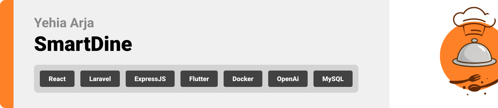

  

<!-- project overview -->

> **SmartDine** is a cloud-powered restaurant system built for speed, scalability, and real-time operations.  
> From AR menus and AI combos to live seat tracking and AI assistant — everything works instantly and in sync.  
> Clean Flutter UI. Secure Laravel backend. Real-time updates via WebSockets.  
> Built to scale. Easy to use. Feels like magic, runs like engineering ⚙️

  

<!-- System Design -->

### Architecture Overview

✅ **Client App**: Flutter mobile app  
✅ **API Layer**: Laravel backend for business logic  
✅ **Real-Time**: Node.js + Socket.IO for WebSocket updates  
✅ **Infrastructure**: Docker + GitHub Actions → AWS EC2  
✅ **Performance**: Redis for caching and queues

#### ER Diagram

#### Component Diagram

  

<!-- Project Highlights -->

> - Personalized dish combos powered by AI  
> - Real-time seat tracking via IoT  
> - AR-enabled menu browsing  
> - Owner dashboards for product insights and recommendations

  

<!-- Demo -->

### User Screens (Mobile)

| Home                              | Onboarding                           | Assistant                           |
| --------------------------------- | ------------------------------------ | ----------------------------------- |
|  |  |  |

| Product Details                         | Search Page                        | AR Dish View                        |
| --------------------------------------- | ---------------------------------- | ----------------------------------- |
|  |  |  |

| AI Chat UI                             |                                     |                                     |
| -------------------------------------- | ---------------------------------- | ---------------------------------- |
|  |                                    |                                     |

### Action Demo (GIFs)

| Splash & Login                     | Home Flow                          | Search                              |
| ---------------------------------- | ---------------------------------- | ----------------------------------- |
|  |  |  |

| Assistant Interaction              | AR Preview                         |                                     |
| ---------------------------------- | ---------------------------------- | ----------------------------------- |
|  |  |                                     |

  

<!-- Development -->

### Development Flow

> SmartDine separates logic cleanly across services and validations:
>
> - **Services:** Modular logic using service classes and sensor integrations.  
> - **Validation:** All inputs go through FormRequest validation and structured schemas.

#### Services

#### Validation

  

<!-- AI Integration -->

### AI-Powered Recommendations 🤖

> SmartDine uses OpenAI to personalize user experience:
>
> 1. **Prompt Parsing** – Structured schema inputs (preferences, past behavior)  
> 2. **Smart Replies** – Recommendations with confidence scores and AI reasoning  
> 3. **Redis Caching** – Cached results for fast load  
> 4. **Multi-role Support** – Personalized AI for users, chefs, and restaurant owners

#### AI Prompt Input

#### AI Response Output

#### AI Demo

  

<!-- Deployment -->

### Deployment Pipeline 🚀

> The **SmartDine** app is deployed using **AWS EC2 instances**:  
>
> - **Production**: `http://52.47.117.218`;    
>
> The application is **containerized using Docker** to ensure consistency across all environments.  
> **CI/CD pipelines** are implemented via **GitHub Actions**, enabling automatic testing and deployment on every push to `main`.

#### GitHub Actions Workflow

#### API Health & Postman Verification

| Login API                        | Fetch Products                     | Fetch Restaurants                  |
| ------------------------------- | ---------------------------------- | ---------------------------------- |
|  |  |  |

  

SmartDine empowers diners, equips restaurateurs, and elevates operations.  
This is restaurant tech done right 🍴

  

## License

This project is licensed under the [MIT License](./LICENSE).
